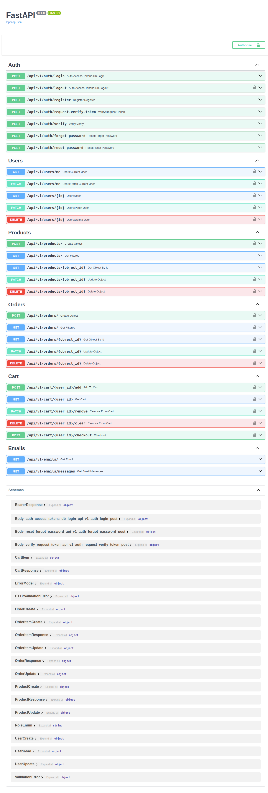
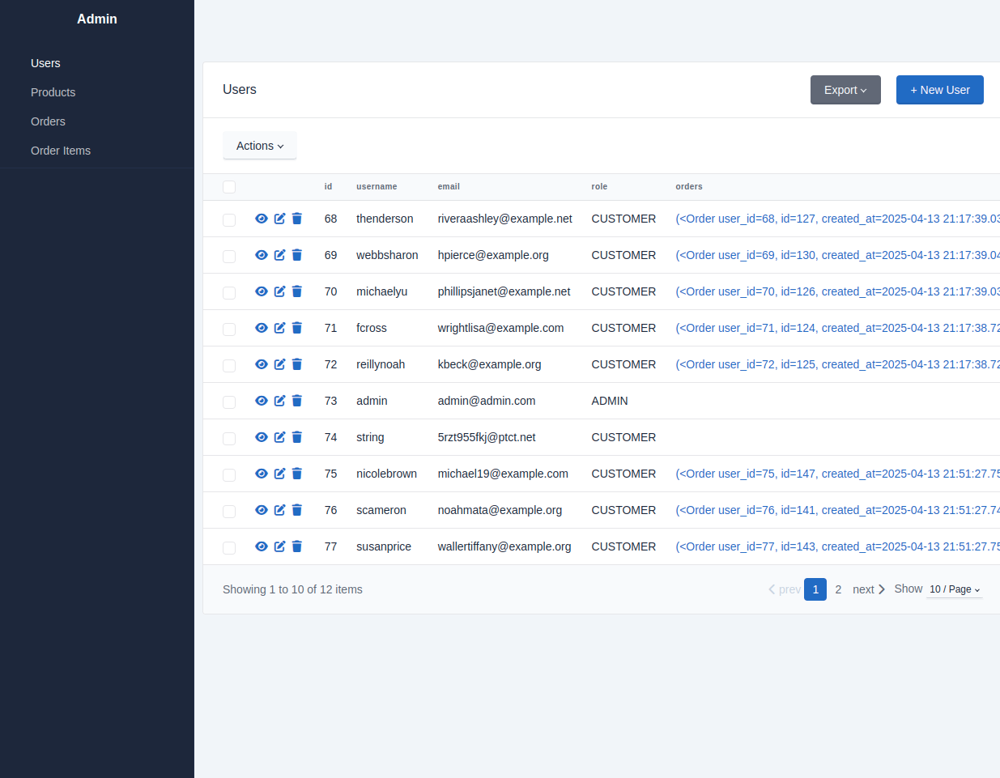
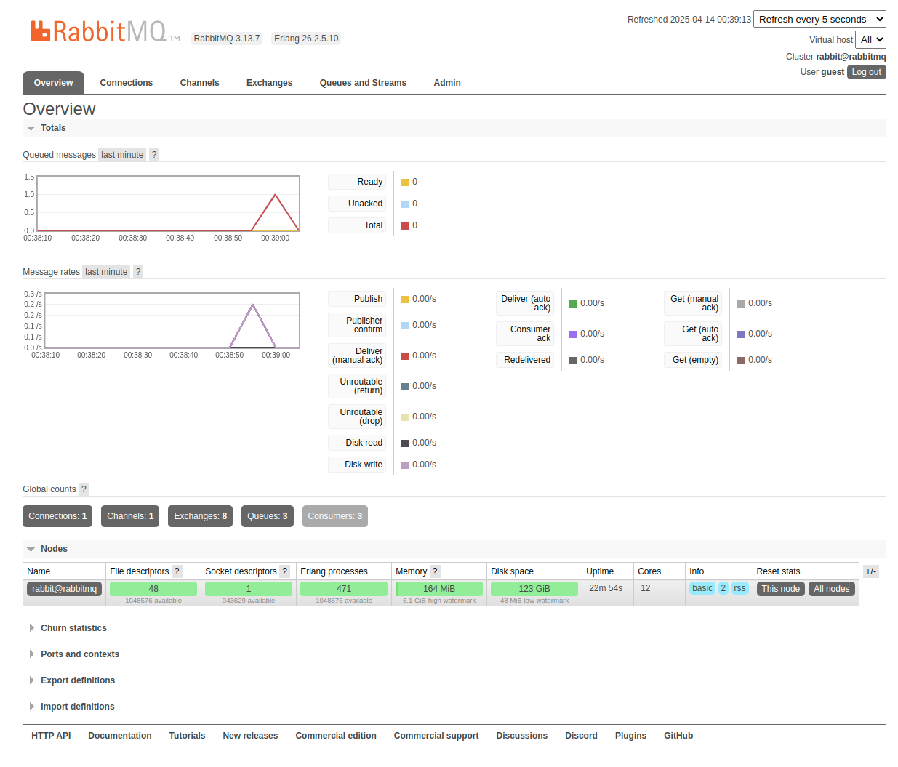
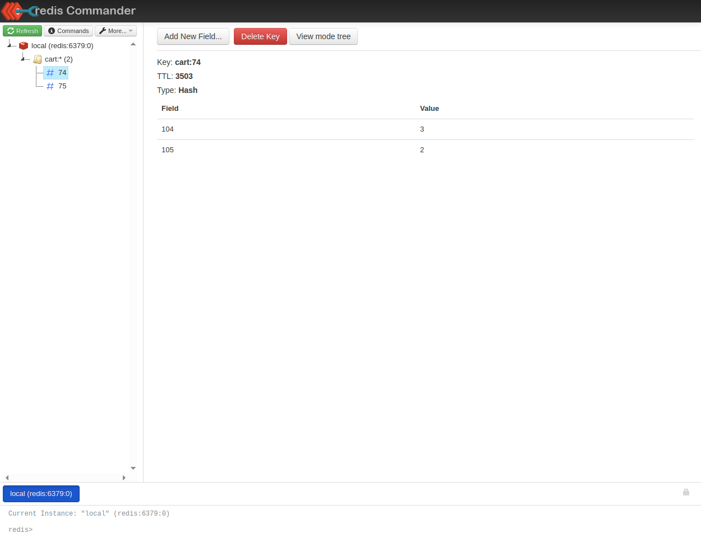
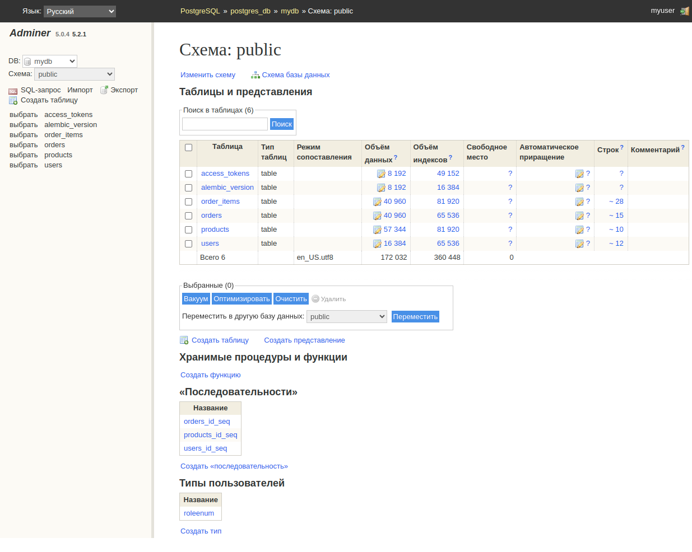

<div align="center">

<h1>FastMall</h1>

<p>
Simple e-commerce backend powered by FastAPI
</p>

<p>

<a href="#about">About</a> •
<a href="#installation">Installation</a> •
<a href="#additionally">Additionally</a>

</p>

</div>

### About

This is a backend service for a simple e-commerce web application built using the FastAPI framework. It includes user
authentication via FastAPI Users, email notifications using RabbitMQ and aio-pika, and a shopping cart implemented with
Redis for caching.

The application uses PostgreSQL as its relational database management system, with Alembic handling database migrations.

### Features

* [x] User registration and authentication;
* [x] Full CRUD operations for products and orders;
* [x] Shopping cart with in-memory storage using Redis;
* [x] Email notifications via message queue;
* [x] Admin panel for managing models;

### Technology Stack

- ⚡ [**FastAPI**](https://fastapi.tiangolo.com) for the Python backend API.
    - 🧠 [Pydantic](https://docs.pydantic.dev) — data validation and configuration management.
    - 🔐 [FastAPI Users](https://fastapi-users.github.io/fastapi-users/latest/) — user authentication and management.
    - 🛠️ [SQLAlchemy](https://www.sqlalchemy.org/) — for the Python SQL database interactions (ORM).
    - 🐘 [PostgreSQL](https://www.postgresql.org) — relational database.
    - 🔄 [Alembic](https://alembic.sqlalchemy.org/en/latest/) — database migrations.
    - ⚡ [Redis](https://redis.io/) — in-memory cache for shopping cart.
- 📨 [RabbitMQ](https://www.rabbitmq.com/) — message broker for async communication.
    - 🐇 [aio-pika](https://docs.aio-pika.com/) asyncio AMQP client for RabbitMQ.
- 🐋 [Docker Compose](https://www.docker.com) — container orchestration for local development and production.
- 🛠️ [sqladmin](https://aminalaee.dev/sqladmin/) — admin dashboard for managing database models via web UI.

### Installation

Clone the project and navigate to the project directory:

```shell
git clone https://github.com/ESergievich/fastapi-project.git && cd fastapi-project && cp .env.template .env
```

Then run the application using Docker Compose:

```shell
docker-compose up
```

The backend server will be available at:
http://localhost:8000

To enable email notifications via RabbitMQ, make sure to set the required [environment variables](#email) in your .env
file.

### Details

This project uses FastAPI Users for user authentication and management.
Authentication is handled using a database strategy and authorization header transport.

Upon registration, users receive a welcome email with a verification link. Additional emails are sent for:

- Email verification requests
- Password reset

You can observe the message broker in action at http://localhost:15672  
Default credentials:

```commandline
Username: guest  
Password: guest
```

<span id="email">To enable email sending, set the following variables in your .env file:](#header-title)</span>

```dotenv
APP_CONFIG__EMAIL__ADDRESS="my_email@gmail.com"
APP_CONFIG__EMAIL__PASSWORD="my_password"
```

Use a real email address or a temporary one from a third-party service.  
To retrieve a test email address and its messages:  
```GET /api/v1/emails/``` — returns a valid temporary email  
```GET /api/v1/emails/messages``` — fetches received messages

#### User Roles

There are three types of users:

Customer — can access only their own data  
Manager — can access and modify all objects  
Admin — full access to everything

Only the customer role can be created via API.
Admin and Manager roles must be created programmatically.
Upon startup, a default admin user is created:

```commandline
Login: admin@admin.com  
Password: admin
```

#### Orders and Cart

Each order is linked to a user and products via a many-to-many relationship (order_items table).

Orders can be created:

* Directly via POST requests
* Through the shopping cart, where users add products
    * Products are added to the cart and stored in Redis for fast access.
    * When the user is ready to place an order, they call the endpoint:  
      ```POST /api/v1/cart/{user_id}/checkout```  
      This creates a new order based on the contents of the cart.

You can inspect the Redis cache (cart contents) via the Redis UI at:  
http://localhost:8081

#### Admin Interface

* 🛠 SQLAdmin is used for the web-based admin panel  
  Available at: http://localhost:8000/admin/


* 🧰 Adminer is used for database administration:  
  Available at: http://localhost:8080/

### Dependencies

* python = "^3.10"
* fastapi = "^0.115.7"
* uvicorn = {extras = ["standart"], version = "^0.34.0"}
* pydantic = {extras = ["email"], version = "^2.10.6"}
* pydantic-settings = "^2.7.1"
* sqlalchemy = {extras = ["asyncio"], version = "^2.0.38"}
* asyncpg = "^0.30.0"
* alembic = "^1.14.1"
* fastapi-users = {extras = ["sqlalchemy"], version = "^14.0.1"}
* faker = "^37.0.0"
* python-slugify = "^8.0.4"
* redis = "^5.2.1"
* aio-pika = "^9.5.5"
* sqladmin = "^0.20.1"
* httpx = "^0.28.1"

### Dev Dependencies

* black = "^25.1.0"
* pytest-asyncio = "^0.25.3"

### Interactive API Documentation

[](https://github.com/ESergievich/fastapi-project/tree/main/img/localhost_8000_docs.png)

### Admin panel

[](https://github.com/ESergievich/fastapi-project/tree/main/img/localhost_8000_admin_user_list.png)

### Message Broker

[](https://github.com/ESergievich/fastapi-project/tree/main/img/localhost_15672_.png)

### Redis cache

[](https://github.com/ESergievich/fastapi-project/tree/main/img/localhost_8081_.png)

### Adminer

[](https://github.com/ESergievich/fastapi-project/tree/main/img/localhost_8080_.png)
